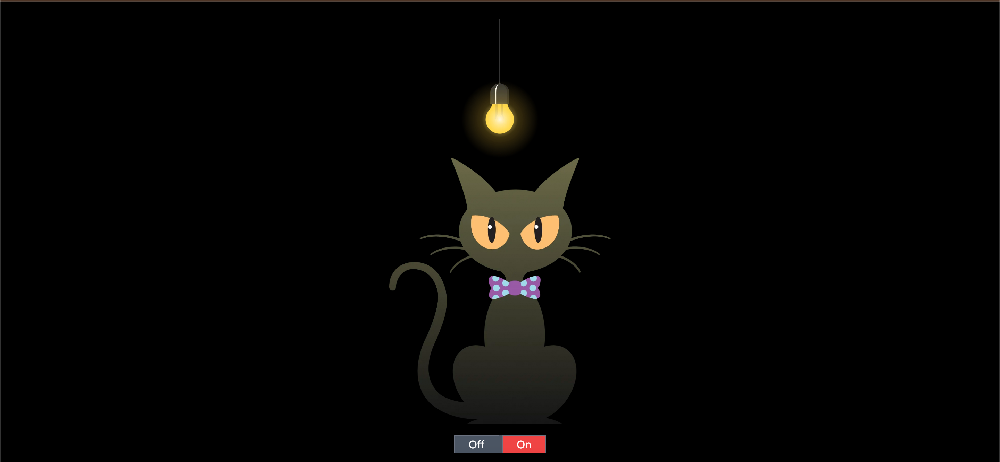
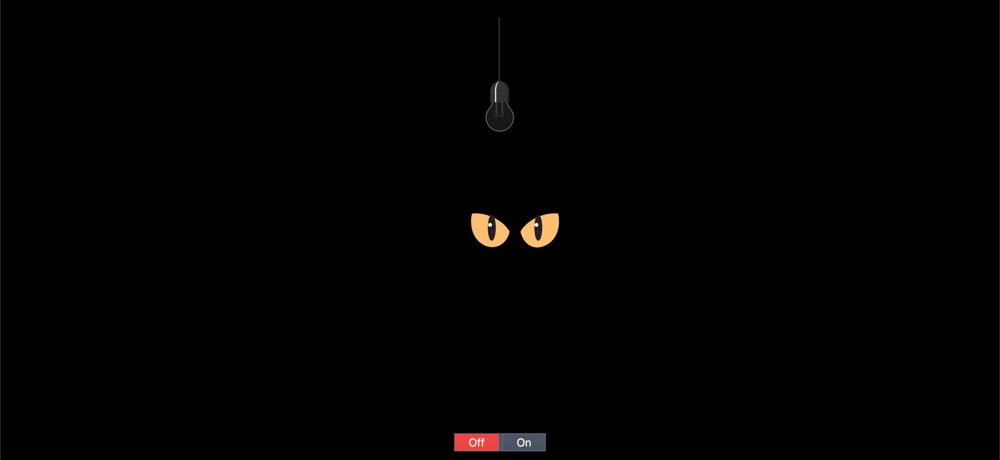

# Cat and Bulb

This is a simple web project that demonstrates toggling between two different visual states using JavaScript and Tailwind CSS. The project shows an image of a cat and a bulb that changes based on user interaction.

## Project Overview

The project consists of two main states:

1. **On State**: Displays an image of a bulb turned on and a cat.
2. **Off State**: Displays an image of a bulb turned off and a cat's eyes glowing in the dark.

Users can switch between these states using two buttons, "On" and "Off".

## Technologies Used

- **HTML**: Markup language used to create the structure of the web page.
- **CSS (Tailwind CSS)**: A utility-first CSS framework to style the web page elements.
- **JavaScript**: Used to add interactive functionality to the buttons.

## Getting Started

To run this project locally, follow the steps below:

### Prerequisites

- A web browser (e.g., Chrome, Firefox)
- A code editor (e.g., VS Code, Sublime Text)

### Installation

1. **Clone the repository**:

    ```bash
    git clone https://github.com/yourusername/cat-and-bulb.git
    ```

2. **Navigate to the project directory**:

    ```bash
    cd cat-and-bulb
    ```

3. **Open `index.html` in your web browser**:

    Open the `index.html` file in your preferred web browser to see the project in action.

## Usage

- Click the **On** button to display the "On State" with the bulb turned on and the full image of the cat.
- Click the **Off** button to switch to the "Off State" with the bulb turned off and the cat's eyes glowing.

## Project Structure


```plaintext
cat-and-bulb/
│
├── index.html         # The main HTML file
├── script.js          # JavaScript file for button functionality
├── README.md          # Project documentation
└── images/            # Folder containing screenshots
    ├── on-state.png   # Screenshot for the "On" state
    └── off-state.png  # Screenshot for the "Off" state

## Screenshots




## License

This project is licensed under the MIT License - see the [LICENSE](LICENSE) file for details.

## Contributing

If you'd like to contribute to this project, please fork the repository and use a feature branch. Pull requests are always welcome.

## Acknowledgments

- This project uses images hosted on ImageKit for the bulb and cat visuals.
- Thanks to the Tailwind CSS team for providing an easy-to-use CSS framework.
