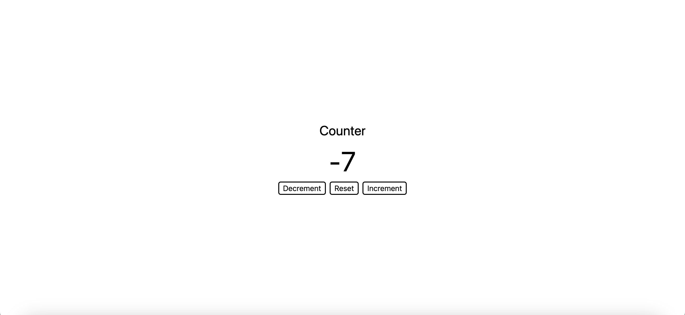
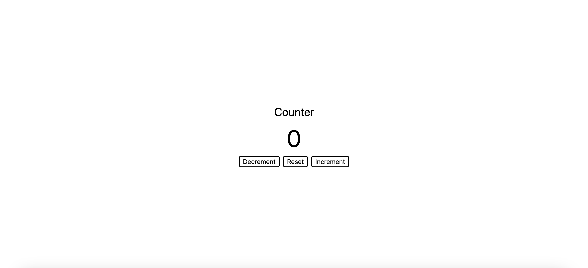
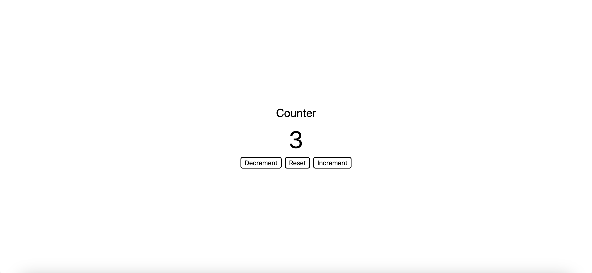

# Counter App

A simple and interactive counter application built with HTML, CSS, and JavaScript. This app allows users to increment, decrement, and reset a displayed number using buttons.





## Features

- **Increment Button**: Increases the displayed number by 1.
- **Decrement Button**: Decreases the displayed number by 1.
- **Reset Button**: Resets the number back to 0.

## Getting Started

### Prerequisites

To run this app, you'll need a modern web browser such as Chrome, Firefox, or Edge.

### Installation

1. **Clone the Repository**:
   ```bash
   git clone https://github.com/your-username/counter-app.git
